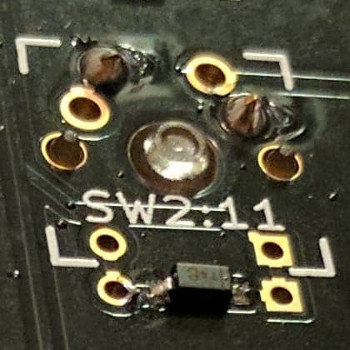
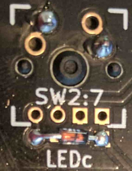
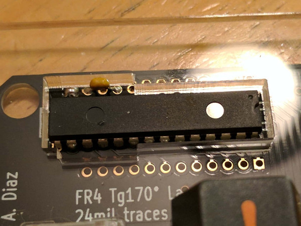
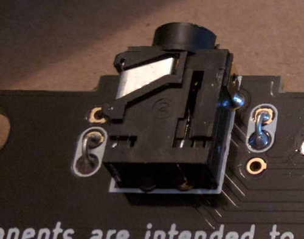
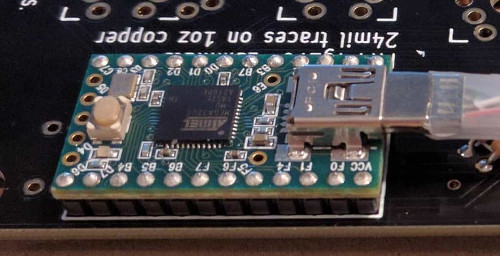
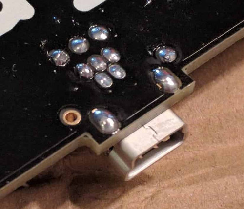
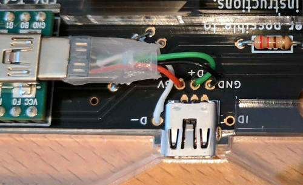

Assembling an ErgoDox is a rewarding experience, but it requires patience and attention to detail. This guide is 
organized into logical phases to help you through the process. 

Before you begin, ensure you have all the [necessary tools and parts](#parts) ready.

### Phase 1: Low-Profile Components (Diodes)

We start with the diodes, as they are the shortest components and easiest to solder first. Diodes are directional and 
must be oriented correctly.

1.  **Preparation**: Flip both PCBs **face down** (this is the side *without* the white silkscreen markings for ICs and
resistors).
2.  **Placement**: 
    -   **Surface Mount (SMD)**: The small line on the diode must face the **square copper pad**. 
    - 
    -   **Through-Hole (THT)**: Bend the legs and insert through the two holes next to the copper pads. The black line 
    on the diode should match the line on the silkscreen (facing the square pad). 
    - 
3.  **Soldering**: Solder all diodes on both PCBs and trim the legs if using THT.

---

### Phase 2: Main ICs and Resistors

Now, flip the PCBs over to the **top side** (with the white silkscreen).

#### Left-Hand PCB: I/O Expander
1.  **MCP23018 (DIP-28)**: Insert the chip into the PCB. Ensure the **notch** on the chip matches the notch on the 
silkscreen outline.
2.  **Capacitor (Optional)**: Insert the **0.1µF ceramic capacitor** into the `C1` position. Bridge the two copper pads 
immediately to the left with a small piece of wire. 

#### Right-Hand PCB: Resistors
Solder the following resistors into their designated spots:
-   **2.2 kΩ Resistors**: Typically labeled `R1` and `R2`.
-   **220Ω Resistors**: Typically labeled `R3`, `R4`, and `R5`.

---

### Phase 3: Connectors and Microcontroller

These taller components should be installed once the flatter electronics are in place.

1.  **TRRS Jacks (Both Hands)**:
    -   Insert the **3.5mm TRRS jacks** and solder.
    -   **Bridge Jumper**: Use jumper wires or clipped diode legs to bridge the white pairs of pads next to the jack as 
    indicated. This is crucial for the two halves to communicate. 
    - 

2.  **Microcontroller (Right Hand)**:
    -   Install male pins to the underside of the **Adafruit ItsyBitsy**.
    -   Solder it to the **right-hand PCB** with the USB port facing the resistors.
    - 

---

### Phase 4: USB and Internal Wiring (Right Hand)

1.  **USB Connector**: Insert the micro USB connector into the right-hand PCB and solder securely. This will serve as 
the external connection to your computer.

2.  **Internal Wiring**: If your case uses a pigtail, strip a micro USB cable and wire it to the PCB pads as follows:

| Wire Color | Function | PCB Pad |
|:-----------|:---------|:--------|
| **Red**    | 5V Power | 5V/VCC  |
| **White**  | Data -   | D-      |
| **Green**  | Data +   | D+      |
| **Black**  | Ground   | GND     |

---

### Phase 5: Switches, LEDs, and Final Case Assembly

1.  **Switches**:
    -   Place the switch plate (if using one) over the PCB.
    -   Insert the **Cherry MX switches** through the plate and into the PCB.
    -   Ensure all pins extend through the holes without bending.
    -   Solder all switches on both halves.

2.  **LEDs (Right Hand Only)**:
    -   Insert **3 mm LEDs** through the switch housings on the right-hand PCB.
    -   **Polarity**: The **shorter leg** (negative) must go into the **square hole**. Solder and trim the excess legs.

3.  **Final Polish**:
    -   Complete the case assembly using screws and standoffs.
    -   Connect the two halves using a **TRRS cable**.
    -   **⚠️ CRITICAL**: NEVER connect or disconnect the TRRS cable while the keyboard is plugged into your computer. 
    This can cause a short and cause permanent damage to the I/O expander!

---

## Other Assembly Guides

External links to some popular guides to building the ErgoDox Keyboard:
- [YouTube Build Guide](https://www.youtube.com/watch?v=x1irVrAl3Ts): There are several other good video guides available on YouTube.
- [Imgur Build Log](http://imgur.com/a/3riAB): User robotmaxtron shares his build log (including mistakes).