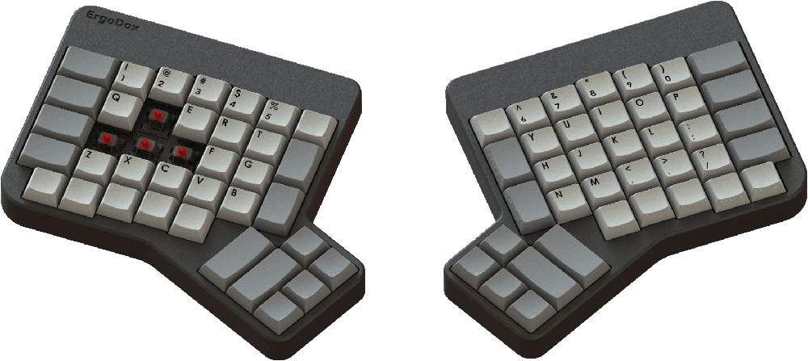

Ergodox is a keyboard project designed with ergonomics in mind, available either as a DIY kit or an 
[assembled, commercial version](https://ergodox-ez.com). It uses 76–80 Cherry MX style mechanical switches (such as 
Cherry or Gateron) 
laid out in a columnar stagger (rather than the more conventional row stagger) layout with components that can easily 
be sourced. The keyboard is completely programmable and can be flashed with several different firmware options.

The entire project (including this website) is open source, allowing you the freedom to modify and tweak the project as 
you see fit.

Assembling this project will require some patience, soldering ability, and access to a computer to flash the firmware 
onto the keyboard.

## Who built this?
The ErgoDox project is the result of many real, human contributors:
- **Dominic Beauchamp ("Dox")**: Original developer, inspired by the [Key64 Keyboard](https://www.key64.org).
- **Fredrik Atmer ("bpiphany")**: Designer of the printed circuit board (PCB).
- **Litster**: Designer of the popular layered acrylic case.
- **Ben Blazak**: Author of the original firmware.
- **Erez Zukerman, Dmitry Slepov, and Yaara Lancet**: Founders of the [ErgoDox EZ](https://ergodox-ez.com).
- **Jack Humbert**: Creator of [QMK Firmware](https://github.com/jackhumbert/qmk_firmware), based on TMK.
- **Max Whittingham ("robotmaxtron")**: Creator of this documentation hub.
- ...and lots of others have contributed to the project in various ways.

### Contributing
Contributions to the documentation and build guides are welcome! If you want to contribute, pull requests and bug 
reports can be filed at our [GitHub repository](https://github.com/robotmaxtron/ergodox-io).

### License
The keyboard design and hardware files are licensed under the **GNU Public License 3**. This website and its content 
are licensed under the **MIT License**.
[GeekHack Thread](https://geekhack.org/index.php?topic=22780.0)
